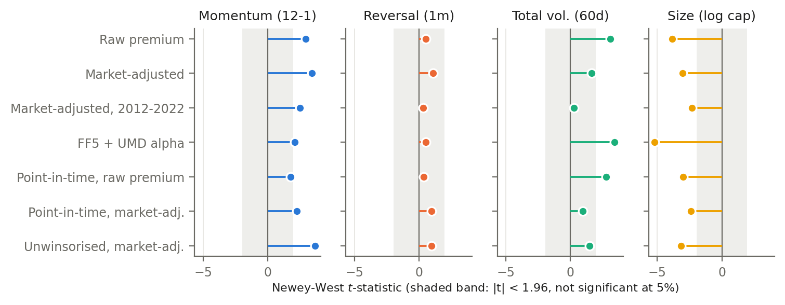

# Cross-Sectional Factor Research with Fama-MacBeth Validation

**Among the 200 largest S&P 500 stocks (2011 to 2026), 12-1 momentum is the only positive premium that remains
significant both once market exposure is removed and under point-in-time index membership (market-adjusted
Fama-MacBeth t = 3.41; 2.26 point-in-time, where the unadjusted premium is no longer significant). It is the standard momentum factor (UMD
loading t = 8.83), not a separate source of return. The strongest raw result, volatility, is market beta under the
CAPM, and its multi-factor alpha has the signature of survivorship bias. Size and reversal are not findings.**

- **One-page summary:** [SUMMARY.pdf](SUMMARY.pdf)
- **Full paper (16 pages):** [paper/Cross_Sectional_Factor_Study_with_Fama_Macbeth_Validation.pdf](paper/Cross_Sectional_Factor_Study_with_Fama_Macbeth_Validation.pdf) (LaTeX source: [`paper/main.tex`](paper/main.tex))



*Fama-MacBeth t-statistic of each factor across specifications. Momentum is significant in every specification
except the unadjusted premium under point-in-time membership (t = 1.76); size is significantly negative throughout
because of survivorship bias.*

---

## Key findings

**Findings**

| Factor | Raw | After risk adjustment and robustness checks | Verdict |
|---|---|---|---|
| **Momentum (12-1)** | FM premium 0.30%/mo per SD, NW t = 2.91 | Market-adjusted 3.7%/yr, t = 3.41 (2.49 before 2023; 2.26 point-in-time; 3.64 unwinsorised). Loads on UMD (t = 8.83); decile portfolio max drawdown -56.3% (2016 to 2023) | Survives market adjustment; is the UMD factor; weaker point-in-time (raw FM t = 1.76, decile t = 0.41) |
| **Reversal (1m)** | Insignificant (t = 0.51) | Turnover 3.44/month, break-even cost 9.7 bps | Eliminated by costs |

**Diagnosed artefacts of the sample** (reported for completeness; they reflect how the universe was built,
not premia)

| Factor | Raw | After risk adjustment and robustness checks | Verdict |
|---|---|---|---|
| **Total volatility (60d)** | FM premium 0.49%/mo, t = 3.07 | Beta 1.17, CAPM alpha insignificant; FF5+UMD alpha 15.95%/yr from loading on unprofitable, high-investment winners; residual premium insignificant point-in-time (t = 1.79) | Market beta under the CAPM; selection under FF5+UMD |
| **Size (log cap)** | Big-minus-small -21.26%/yr | Alpha survives SMB; shrinks 25.4% point-in-time | Survivorship bias, not a size effect |

## Method

- **Timing:** the factor paired with month *t*'s return uses prices only to the end of *t-1* (verified by hand).
- **Three lenses:** equal-weighted decile long-short portfolios; Fama-MacBeth regressions on z-scored factors with
  Newey-West t-statistics; monthly rank information coefficients.
- **Sample:** daily prices January 2011 to September 2026; the return sample with all four factors runs from
  February 2012 to August 2026 (175 months).
- **Validation:** 60/40 and pre/post-2023 splits; CAPM alphas vs SPY, beta as an FM control and market-adjusted FM
  slopes; 10 bps costs with break-evens.
- **Robustness extensions (pre-registered):** drawdowns and Calmar ratios; FF5+UMD alphas;
  a point-in-time S&P 500 membership filter with an audited ticker-rename map; unwinsorised factors. Their
  specifications and interpretation rules were committed in [`src/robustness_spec.py`](src/robustness_spec.py)
  before any of them was run, and no original number changed.
- **Also checked:** sector-neutral construction (ranking within GICS sectors leaves the Fama-MacBeth premia close to
  their originals, so the factors are not simply sector bets).

## Issues found and fixed along the way

- **Momentum overlapped reversal:** the first window `P(t-1)/P(t-13)` included the reversal month; fixed to `P(t-2)/P(t-13)`.
- **Partial final month:** prices end mid-September 2026, so an incomplete final month is now dropped.
- **Outliers in both tails:** SanDisk's 12-1 momentum exceeded 5,000%; Vertiv's SPAC shell implied near-zero
  volatility. Hence two-sided, per-month winsorisation (and an unwinsorised check, which strengthens momentum).
- **Benchmark choice:** an average of the study universe shares its survivorship bias, so alphas use SPY and French factors.
- **Renamed tickers:** the membership history records the symbol in use on each date (FB before META, UTX before
  RTX, and IR, which passed from Trane to a different company in 2020), so a date-bounded alias table links them.

## Limitations

- **Survivorship bias:** the universe is the September 2026 top 200. The point-in-time filter removes stocks before
  they joined the index, but firms that left it are still missing.
- **Risk model asymmetry:** French factors are survivorship-free, the test portfolios are not, so multi-factor alphas
  partly measure selection.
- **Power:** 175 months, about 20 stocks per decile; no premium outside 2023 to 2026 clears t > 3.
- **Costs:** flat 10 bps per unit turnover; no market impact or borrow costs.

## Reproducing the results

```bash
pip install -r requirements.txt

# run from the repository root, in this order
python src/fetch_universe.py
python src/fetch_market_caps.py
python src/fetch_prices.py
python src/fetch_market.py
python src/fetch_french.py
python src/fetch_sp500_history.py
python src/sanity_check_prices.py
python src/compute_momentum.py
python src/compute_reversal.py
python src/compute_volatility.py
python src/compute_size.py
python src/compute_beta.py
python src/check_factor_distributions.py
python src/winsorize_factors.py
python src/decile_backtest.py
python src/fama_macbeth.py
python src/validation_costs.py
python src/extensions.py
python src/risk_adjustment.py
python src/information_coefficient.py
python src/drawdowns.py
python src/multifactor_alphas.py
python src/point_in_time.py
python src/raw_factors.py
python src/make_figures.py
python src/make_tables.py
```

Downloaded data (`data/`) and intermediate results (`output/`) are not committed; the scripts regenerate them.
Market caps and constituents are fetched live, so a rerun on a later date gives a slightly different universe.
The paper (`paper/main.tex`) and summary (`paper/summary.tex`) compile with pdflatex.

```
src/        pipeline scripts (one per stage)
paper/      LaTeX sources, compiled paper, generated tables/ and figures/
SUMMARY.pdf one-page summary
```

---

Zack Higham · BSc Mathematics (Statistics, Financial and AI pathway), Queen Mary University of London
